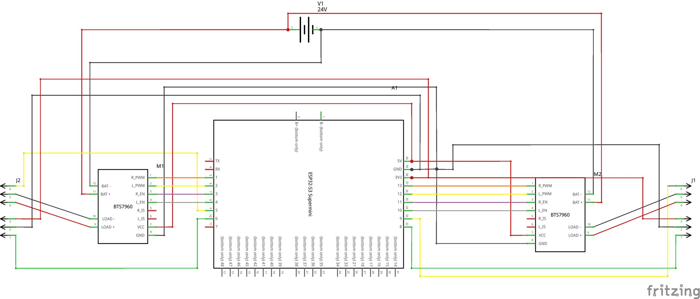
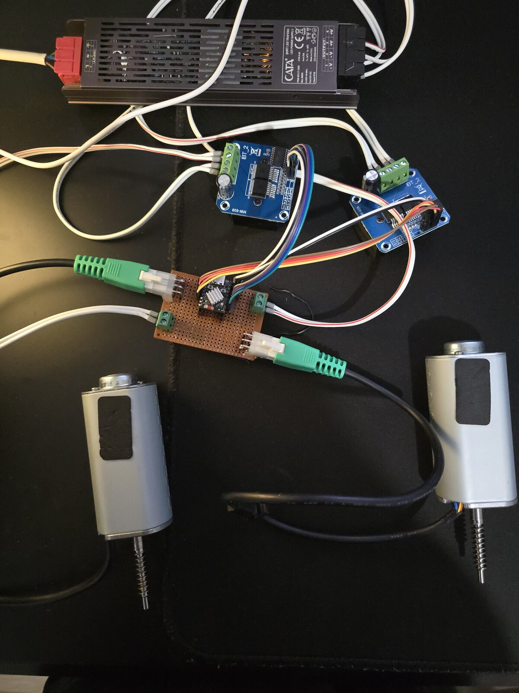
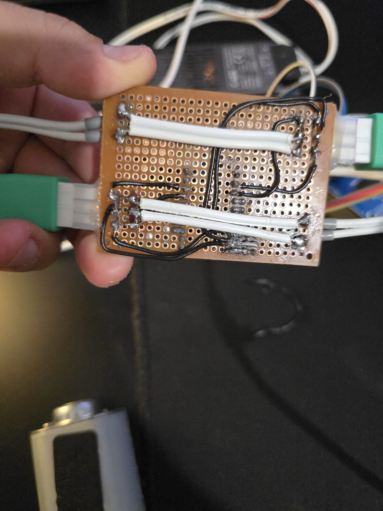

# ESP Desk Controller RS

## Motivation

My IKEA UPPSPEL standing desk broke one day. After checking it, I realized the
problem was the controller, a JCB36N2. I still do not know exactly why it failed.
I tried to repair it, but unfortunately I could not get it working again.

Until the desk broke, I did not realize how important having a working standing
desk was for me. The goal of this project is to build a replacement controller
without spending much money on electronics, using parts that are widely
available.

## Demo

https://github.com/user-attachments/assets/1bbbc4fd-5dba-4966-a858-7fe3071df6df

_Apologies for the heavily compressed video due to GitHub video limits the video is running at 2x speed. I wanted to demonstrate the homing and movement sequence while showing the desk legs' synchronization capabilities with a digital angle finder. (Also, the cable mess is only because the project is not finished yet. I swear I'm more organized normally :D)_

## Hardware

This is the hardware I used. The desk does not have to be an IKEA UPPSPEL, but
the firmware is currently written around a two-leg standing desk with encoder
feedback on each leg.

- IKEA UPPSPEL standing desk
- JS36DR linear actuator x2, one for each leg
- JXET-18-50 24V 5A 120W DC motor inside each linear actuator
- IBT-2 / BTS7960 motor controller x2
- ESP32-S3 SuperMini
- 24V 300W PSU
- Wires and connectors to connect everything together

The motor encoder is crucial for this project. The firmware uses quadrature
encoder feedback to track desk height, detect movement/stalls, and keep the two
legs synchronized. If your motors do not have encoders, the movement code will
need a meaningful refactor.

The motor controller can be a different model, but it needs to behave like an
H-bridge so the firmware can drive each motor both up and down. It also needs PWM
speed control.

The ESP32-S3 is not strictly mandatory, but this project currently uses MCPWM
for motor PWM, PCNT for quadrature counting, and WiFi for MQTT control. Those
peripherals are available on the ESP32-S3, which is why I used it.

## GPIO / Board Mapping

The GPIO mapping for my ESP32-S3 SuperMini wiring is in `src/board.rs`. Change
that file if your motor driver pins, encoder pins, or board wiring are different.

GPIOs are compile-time HAL resources in this firmware, not MQTT/runtime config.
After changing `src/board.rs`, rebuild and reflash the firmware.

The current map is:

- Left leg: drive-left enable GPIO4, drive-right enable GPIO3, drive-left PWM
  GPIO2, drive-right PWM GPIO1, encoder hall A GPIO5, encoder hall B GPIO6
- Right leg: drive-left enable GPIO10, drive-right enable GPIO11,
  drive-left PWM GPIO12, drive-right PWM GPIO13, encoder hall A GPIO9,
  encoder hall B GPIO8

Motor direction and encoder polarity can still be calibrated later through MQTT
with the `hardware/*` config fields. That calibration changes which motor side
means up and which encoder direction means up; it does not change which ESP32
pins are connected.

## Hardware Images

The images below show my wiring/soldering setup. They are not a universal wiring
guide; always verify your own motor controller, power supply, connectors, and
ESP32 pinout before powering anything.

Wiring scheme:



Wiring photo:



Soldering photo:



As you can see, my soldering and wiring job is awful :D It does still magically work, and hopefully I can make a PCB for this project soon.

## Running / Compilation

I could try to write a full guide for how to run this project, but it is much
better to follow Espressif's official Rust book:
https://docs.espressif.com/projects/rust/book/getting-started/index.html

I created this project using `esp-generate`. After the Espressif Rust toolchain
and flashing tools are set up, running this should build and flash the firmware
to the ESP32-S3:

```sh
cargo run --release
```

Before flashing, check `.env.example` and fill in your own WiFi and MQTT details.
Those values are read at compile time, so rebuild and reflash after changing
them.

## First Run and Safety

Be careful during first power-on. This firmware can move a real desk with real
force. Test with low movement counts, keep a way to cut power quickly, and do not
trust the default directions until you verify them on your own hardware.

The desk starts in an unhomed state after boot. In that state, the firmware does
not yet know the real travel range or zero position, and normal movement
commands like `desk/cmd/up`, `desk/cmd/down`, `desk/cmd/move_to`, and
`desk/cmd/move_by` are rejected. Full homing drives the desk downward first, so
you must verify the configured motor and encoder directions before trusting
`desk/cmd/home`.

The most important first check is direction. When the firmware commands a leg
up, the leg must physically move up. The encoder direction must also match the
firmware's idea of up, because height tracking, homing, stall detection, and leg
synchronization all depend on encoder counts.

If possible, remove the legs/actuators from the desk frame before these tests,
or otherwise test with the mechanism unloaded and supported. Testing one leg in
the assembled desk can create skew and mechanical stress very quickly if a
direction is wrong.

Before the first movement test, you may also want to lower the duty values so
the desk moves as slowly as possible. Manual override uses the `leg/*` duty
values, while normal synchronized desk movement uses the `desk/*` duty values:

```sh
# Lower leg startup boost duty to 20%. This affects manual override startup too.
mosquitto_pub -h 192.168.1.10 -t desk/config/set/leg/startup_duty -m "20"

# Lower individual-leg run duty to 20%. This affects manual override movement.
mosquitto_pub -h 192.168.1.10 -t desk/config/set/leg/run_duty -m "20"

# Lower individual-leg homing duty to 15%.
mosquitto_pub -h 192.168.1.10 -t desk/config/set/leg/homing_duty -m "15"

# Lower coordinated run duty to 20%.
mosquitto_pub -h 192.168.1.10 -t desk/config/set/desk/move_run_duty -m "20"

# Lower coordinated slow-zone duty to 15%.
mosquitto_pub -h 192.168.1.10 -t desk/config/set/desk/move_slow_duty -m "15"

# Lower coordinated homing duty to 15%.
mosquitto_pub -h 192.168.1.10 -t desk/config/set/desk/homing_run_duty -m "15"
```

The `desk/homing_obstruction_*` settings control homing contact detection. When
`desk/homing_obstruction_sensitivity` is `on`, homing treats a sustained
per-leg encoder speed drop as contact with the lower stop and stops that leg
early. If you set it to `off`, homing falls back to the original no-progress
stall timeout behavior.

Very low duty is not guaranteed to move the desk. Static friction may be higher
than the motor torque at low PWM, so the motor can fail to start, hum, or stall.
If that happens, increase duty slowly and keep the movement counts small.

Use manual override for the first direction tests. Override mode must be
explicitly unlocked, then each leg can be moved by a small encoder-count amount:

```sh
# Watch status in another terminal. Check left_position, right_position, and skew_counts.
mosquitto_sub -h 192.168.1.10 -t desk/status -v

# Watch command responses in another terminal.
mosquitto_sub -h 192.168.1.10 -t desk/response -v

# Unlock manual override mode. The payload must be exactly UNLOCK.
mosquitto_pub -h 192.168.1.10 -t desk/cmd/override/unlock -m "UNLOCK"

# Move the left leg a tiny amount upward.
mosquitto_pub -h 192.168.1.10 -t desk/cmd/override/leg/left/up -m "10"

# Move the right leg a tiny amount upward.
mosquitto_pub -h 192.168.1.10 -t desk/cmd/override/leg/right/up -m "10"

# Stop immediately if anything looks wrong.
mosquitto_pub -h 192.168.1.10 -t desk/cmd/stop -n
```

If an override up command moves a leg down, change that leg's hardware
`up_drive` through MQTT. Hardware calibration updates are accepted only while the
desk is idle and unhomed or faulted:

```sh
# Valid payloads are "left" and "right".
# Pick only the affected leg/value; these are examples.
mosquitto_pub -h 192.168.1.10 -t desk/config/set/hardware/left/up_drive -m "right"
mosquitto_pub -h 192.168.1.10 -t desk/config/set/hardware/right/up_drive -m "right"
```

If the leg physically moves up but the reported encoder position moves in the
wrong direction, change that leg's hardware `up_direction` through MQTT:

```sh
# Valid payloads are "positive" and "negative".
# Pick only the affected leg/value; these are examples.
mosquitto_pub -h 192.168.1.10 -t desk/config/set/hardware/left/up_direction -m "negative"
mosquitto_pub -h 192.168.1.10 -t desk/config/set/hardware/right/up_direction -m "negative"
```

You can see what the quadrature encoder is doing through `desk/status`.
`left_position` and `right_position` are the values to watch. During an override
up test for one leg, the matching position should move in the expected direction
and the other leg should stay still. If the physical movement is correct but the
position moves the wrong way, the encoder direction config is wrong.

Manual override is only a bring-up/recovery tool. After an override operation
finishes, the unhomed encoder positions are reset so a later full home does not
inherit arbitrary test offsets. Watch `desk/status` while the override command is
running if you want to see the encoder direction.

You can request the current config at any time. The hardware fields are
published as `hardware.left_up_drive`, `hardware.left_up_direction`,
`hardware.right_up_drive`, and `hardware.right_up_direction`:

```sh
mosquitto_pub -h 192.168.1.10 -t desk/config/get -n
```

Check both legs independently before trusting synchronized movement. If one leg
is reversed, the desk can skew badly. After direction is correct, tune low-risk
values first: movement duty, slow duty, startup events, target tolerance, and
maximum travel. Only then test full homing:

```sh
mosquitto_pub -h 192.168.1.10 -t desk/cmd/home -n
```

After homing succeeds, the desk enters ready state and normal synchronized
movement commands can be used. Then start tuning skew limits and obstruction
detection.

If you have manually verified that both legs are already at the lower reference
position, `force_home` can mark the current position as zero without moving the
motors:

```sh
mosquitto_pub -h 192.168.1.10 -t desk/cmd/force_home -n
```

Only use this when you can visually trust the current physical position. The
firmware will immediately enter ready state and normal movement commands will
use that forced zero.

## Control and Configuration

This project exposes a lot of runtime configuration through MQTT. The config
source files are commented so you can check each option, its unit, and what it
changes:

There is also a machine-readable AsyncAPI 3.1 contract in `docs/asyncapi.yaml`.
Validate it with `npx @asyncapi/cli validate docs/asyncapi.yaml`. AsyncAPI
tooling can use it to generate docs or client/server scaffolding, and it
includes project-specific `x-*` fields for config paths and key/value payload
details.

- `src/config/desk.rs`: coordinated desk movement, homing, sync, obstruction,
  override, and status publish settings
- `src/config/hardware.rs`: per-leg motor side and encoder direction calibration
- `src/config/leg.rs`: per-leg duty, homing, stall, target, and travel settings
- `src/config/runtime.rs`: validation rules between desk-level and leg-level
  settings
- `src/config/mod.rs`: config module layout and exported config types

For MQTT control, the most useful files are:

- `src/mqtt/settings.rs`: builds the full topic names from `MQTT_TOPIC_PREFIX`
- `src/mqtt/topics.rs`: lists command and override topic suffixes
- `src/mqtt/config_api.rs`: lists every configurable MQTT field path
- `src/mqtt/commands.rs`: parses incoming command payloads and config updates

With the default `.env.example` topic prefix, commands are under `desk/...`.
Replace `desk` with your own `MQTT_TOPIC_PREFIX`.

Examples:

```sh
# Ask the firmware to publish the current runtime config to desk/config.
mosquitto_pub -h 192.168.1.10 -t desk/config/get -n

# Change coordinated movement run duty to 35%.
mosquitto_pub -h 192.168.1.10 -t desk/config/set/desk/move_run_duty -m "35"

# Move 100 encoder counts upward.
mosquitto_pub -h 192.168.1.10 -t desk/cmd/up -m "100"

# Trust the current physical position as zero without moving.
mosquitto_pub -h 192.168.1.10 -t desk/cmd/force_home -n
```

Command responses are published to `<prefix>/response`, status is published to
`<prefix>/status`, and full config snapshots are published to `<prefix>/config`.
Hardware calibration fields are persisted with the rest of the runtime config,
but hardware updates and `config/reset` are accepted only while the desk is idle
and unhomed or faulted.

## Design Decisions

These decisions are somewhat subjective and parallel to my own experience with
this project.

### Why MQTT?

MQTT makes sense for this controller because the firmware does not need a local
screen, buttons, HTTP server, or custom phone app just to be useful. The ESP32
connects to WiFi, subscribes to command/config topics, and publishes status,
responses, and current configuration back to the broker.

It also fits the command model well. Commands are small messages, the broker
handles delivery between clients, and other tools can subscribe to status or
responses without being tightly coupled to the firmware. This makes it easy to
control the desk from `mosquitto_pub`, Home Assistant, scripts, dashboards, or
anything else that can speak MQTT.

### Why PCNT?

The project uses the ESP PCNT peripheral for quadrature encoder counting because
it made a big difference in reliability. Before using PCNT, I tried classic GPIO
reads for quadrature signals. When the motor was spinning fast, the firmware
could miss transitions and lose encoder counts.

PCNT counts pulses in hardware, so the firmware does not need to catch every
edge in software at the exact moment it happens. That matters here because
encoder position is used for height tracking, homing, stall detection, and leg
synchronization.

### Why MCPWM?

MCPWM was available on the ESP32-S3, so I used it for motor PWM control. I am
not sure it is strictly necessary with IBT-2 / BTS7960 motor drivers, but it is a
hardware PWM peripheral meant for motor-control-style workloads. Since it was
available, using it made sense.

### Why Home to the Bottom?

The desk does not have an absolute position sensor. The firmware only knows
relative movement from the encoders, so it needs a repeatable reference point
before it can trust height values. Homing downward until the legs stop moving
gives the firmware a practical zero position. After that, it backs off from the
bottom stop and treats that position as the start of the usable travel range.

### Why No Original Handset Support?

The main goal was replacing the broken controller first. MQTT was simpler and
more flexible than reverse engineering or wiring the original handset protocol
into this firmware.

There was also a practical hardware limit: on the ESP32-S3 SuperMini, I did not
have many pins left. Otherwise, I already have a separate Jiecang handset
controller project that could potentially be reused here:
https://github.com/kralonur/jiecang-handset-controller

### Why Obstruction Detection by Speed Drop?

This project does not use separate force sensors. IBT-2 / BTS7960 boards do have
current-sense pins, but I did not have many spare pins left on the ESP32-S3
SuperMini. Also, if the motor drivers are changed later, not every controller
will expose current sensing.

Encoder speed drop is not perfect, but it is available with the hardware this
project already requires. That makes the obstruction logic more universal across
different H-bridge drivers and still gives the firmware a software safety layer.
Homing uses separate `desk/homing_obstruction_*` threshold settings for per-leg
lower-stop contact detection; disabling homing obstruction leaves homing on the
older stall-timeout method.

### Why Embassy Instead of ESP-IDF?

Honestly, I do not have huge experience with either ESP-IDF or Embassy. Embassy
and `no_std` simply felt more natural to me for this project, and the pieces
felt more loosely coupled during development.

I used Embassy because I wanted a mostly Rust, `no_std` async firmware stack
built around `esp-hal`, hardware peripherals, and explicit tasks. This project
has several things happening at the same time: WiFi networking, MQTT sessions,
motor control, quadrature counting, status publishing, command handling, and
timers. Embassy makes that concurrency model feel natural without pulling in a
full ESP-IDF application runtime.

ESP-IDF would also be a valid choice, especially if you want the most mature
Espressif networking stack, `std` support, OTA helpers, filesystem support, or
closer compatibility with existing ESP-IDF examples. For this project, I wanted
direct HAL access to peripherals like MCPWM and PCNT, and Embassy's async model
was enough for the networking and control tasks.

## Limitations

- This project currently targets a two-leg standing desk.
- Quadrature encoder feedback is required by the current movement, homing, sync,
  and safety logic.
- The firmware assumes each motor can be driven up and down through an H-bridge
  with PWM speed control.
- The current hardware wiring and peripheral setup are written for ESP32-S3.
- There is no web UI, display, keypad, or original desk handset support.
- There is no OTA update flow.
- This is not a certified replacement controller or a safety-certified motor
  controller.

## Disclaimer

Take everything here with a grain of salt. Some information might be incorrect;
this is based on my own research and my own hardware. Anyone who wants to use
this project should carefully inspect and verify their own desk, motors,
connectors, power supply, wiring, and electronics before adapting this project.
